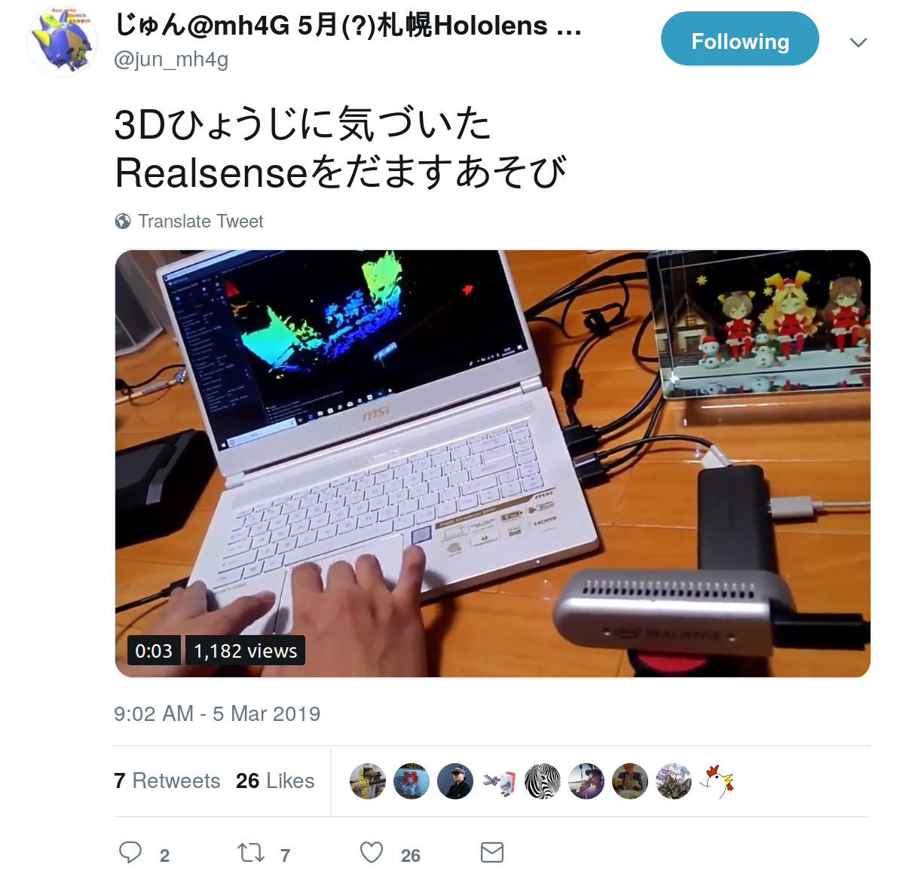

# RealSenseLookingGlassRecursion
Experimenting with the fact that the Intel RealSense will get depth data from 3d content on the Looking Glass Display

Inspired by this tweet (https://twitter.com/jun_mh4g/status/1102932506901307398) by [**@jun_mh4g**](https://www.twitter.com/jun_mh4g)

Here I have set up a project with the Intel Realsense (https://github.com/IntelRealSense/librealsense) and Looking Glass Display Holoplay SDK (https://lookingglassfactory.com/downloads/holoplay-sdk-looking-glass/)
with the goal of trying to undertand new and interesting interaction patterns by looping depth display on itself. 

-------

Great video example from [@enjrolas](https://www.twitter.com/enjrolas) (Twitter)

Youtube: [**alex archive** - Filming holograms with the realsense](https://www.youtube.com/watch?v=Rnau4ptFm7U)

-------

There is a scene in `Scenes/RSRecursion` that is set up to display an RS D435 point cloud at about 20-40cm from a Looking Glass Display and render with the LookingGlass Holodisplay Game Camera.

My results have been mixed so far, but I see a lot of potential in the pattern. Potentially a D415 is better suited for this 
than the wide angle D435 More updates to come.
